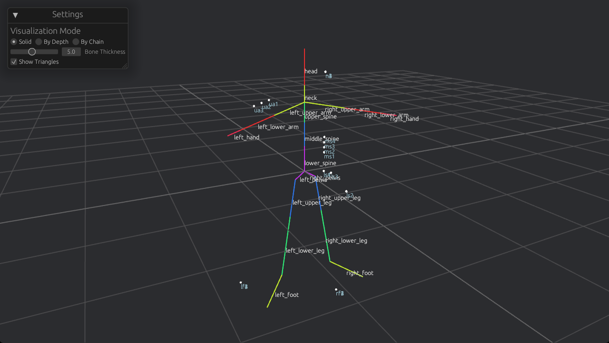

# Hooded Crow Modeller

A command line, low poly, parametric 3D modeller, with a synchronized GUI component to visualize changes on the fly.

The modelling is done by defining a skeleton (consisting of bones and the joints between them). Basically, it's a directed graph with edge attributes, encoded in a TOML file. Attributes are inherited from the parent bone. Bones have skin vertices, defining the actual mesh. No animation is supported yet, altough the implementation is designed with this in mind. Everything is relative, no coordinates needed / supported.




Syntax example

```toml
[body]

[body.lower_spine]
len = 0.20
orient = 0
slope = 90
rot = 0

[body.lower_spine.skin_verts]
ls1 = { len = 0.5, dist = 0.3, rot = 0, tri = { f1 = 0 }, col = [0.0,0.0,1.0,0.5] }
ls2 = { len = 0.3, dist = 0.6, rot = 90, tri = { f1 = 1 }, col = [0.0,0.0,1.0,0.5] }
ls3 = { len = 0.6, dist = 0.4, rot = 180, tri = { f1 = 2 }, col = [0.0,0.0,1.0,0.5] }

[body.lower_spine.middle_spine]
len = 0.18

[body.lower_spine.middle_spine.upper_spine]
len = 0.15

[body.lower_spine.middle_spine.upper_spine.left_upper_arm]
len = 0.3
orient = 100
slope = 20
rot = 0
```

run via:
```Bash
cargo run --bin viewer example.toml
```

The modeller supports hot-reloading, so the viewer window is updated as soon as the loaded file is edited (and saved).
